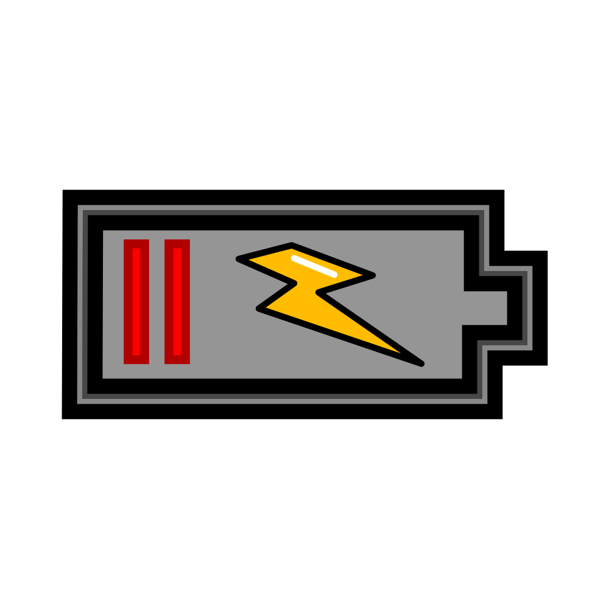

# Critical Charge ⚡

Welcome to **Critical Charge** - a high-speed endless runner game where your device's battery level determines your speed! The lower your battery, the faster you go, creating a thrilling challenge that gets harder as you play.

## 🎮 How to Play

### **Objective**
Survive as long as possible by avoiding obstacles on a futuristic track. Your score increases based on how far you travel, and the game gets faster as your battery drains!

### **Controls**
Critical Charge supports multiple input methods for both desktop and mobile devices:

#### **Keyboard Controls (Desktop)**
- **← Left Arrow / A**: Move left
- **→ Right Arrow / D**: Move right  
- **↑ Up Arrow / W**: Jump over obstacles
- **Space**: Restart game when game over
- **P / ESC**: Pause game
- **L**: Load saved game

#### **Touch Controls (Mobile)**
- **Swipe Left**: Move left
- **Swipe Right**: Move right
- **Swipe Up**: Jump
- **Tap Top 15% of Screen**: Pause game
- **Tap Anywhere Else**: Restart game (when game over)

#### **Gyroscope Controls (Mobile)**
- **Tilt Left**: Move left
- **Tilt Right**: Move right

### **Gameplay Features**

#### **Core Mechanics**
- **Battery-Powered Speed**: Your device's actual battery level controls your speed! The lower your battery, the faster you go (up to 8x speed at 0% battery).
- **Three-Lane Movement**: Move between left, center, and right lanes to avoid obstacles.
- **Jumping**: Leap over obstacles when they get too close.
- **Endless Track**: The game generates an infinite track with procedurally placed obstacles.

#### **Scoring System**
- **Score**: Earn points based on distance traveled. Higher speeds earn more points per second.
- **High Score**: Your best score is saved automatically and displayed on the game over screen.

#### **Save & Load**
- **Auto-Save**: The game automatically saves your progress when you pause.
- **Manual Load**: Press **L** or click the **LOAD GAME** button to continue from your last save.

#### **Visuals & Audio**
- **Futuristic Aesthetics**: Neon-lit track with glowing edges and sci-fi visual effects.
- **Dynamic HUD**: Displays your score, high score, battery percentage, and current velocity.
- **Pause Screen**: Shows "CRITICAL BREAK" with resume and load options.
- **Game Over Screen**: Displays "CRITICAL FAILURE" with your final score and high score.

## 🔋 Battery Mechanics

The game uses your device's **real battery status** through the Battery Status API:

- **100% Battery**: Slowest speed (1x), easiest gameplay
- **50% Battery**: Medium speed (4-5x)
- **0% Battery**: Fastest speed (8x), most challenging

> ⚠️ **Note**: The Battery Status API is only supported on Chromium-based browsers (Chrome, Edge, Opera) on Android, Windows, and macOS. If you're using an unsupported browser (like Safari or Firefox), you'll see a "HARDWARE UNSUPPORTED" message.

## 🕹️ Game Screens

### **Main Gameplay**

- **Player**: Your 8-bit character running along the track
- **Obstacles**: Barriers that appear in different lanes
- **Track**: Infinite scrolling road with neon edges
- **HUD**: Shows score, high score, battery %, and velocity

### **Pause Screen**
- Shows "CRITICAL BREAK" with two options:
  - **RESUME**: Continue your current game
  - **LOAD GAME**: Load your last saved game

### **Game Over Screen**
- Shows "CRITICAL FAILURE" with:
  - Your final score
  - High score
  - Two options:
    - **RESTART**: Start a new game
    - **LOAD GAME**: Continue from your last save

## 💾 Save System

Critical Charge features a robust save system:

- **Automatic Saves**: Every time you pause the game, your progress is saved automatically.
- **Manual Loading**: Press **L** or click **LOAD GAME** to continue from your last save.
- **High Score Tracking**: Your best score is always saved and displayed.

> 💡 **Tip**: Pause the game frequently to save your progress, especially when your battery is getting low!

## 🛠️ Technical Requirements

### **Supported Platforms**
- **Desktop**: Chrome, Edge, Opera (Windows/macOS)
- **Mobile**: Chrome, Edge (Android)

### **Unsupported Platforms**
- iOS devices (Safari)
- Firefox browsers
- Any browser without Battery Status API support

## 🎯 Tips & Strategies

1. **Battery Management**: Play when your battery is full for the easiest experience, or challenge yourself at lower battery levels!

2. **Obstacle Timing**: Watch for obstacles appearing in the distance and plan your lane changes early.

3. **Jump Technique**: Time your jumps carefully - you need to be at least 50 pixels high to clear obstacles.

4. **Save Often**: Pause frequently to save your progress, especially when you're doing well.

5. **High Score Chasing**: The faster your speed (lower battery), the more points you earn per second.

6. **Gyroscope Advantage**: On mobile, use the tilt controls for more precise lane changes.

## 🚀 Getting Started

1. Open the game in a **Chromium-based browser** (Chrome, Edge, Opera)
2. Allow battery status permissions if prompted
3. Use your preferred controls to start playing
4. Avoid obstacles and survive as long as possible!

## 📊 Scoring Details

Your score increases continuously based on:
- **Distance traveled** (track position)
- **Current speed** (determined by battery level)

The formula: `Score = Distance × Speed Multiplier`

At 100% battery: 1x multiplier  
At 0% battery: 8x multiplier

## 🔄 Game Reset

When you crash or restart:
- Your final score is checked against the high score
- If it's a new record, it becomes the new high score
- All game state is reset for a fresh start

## 🧪 Testing & Development

The game includes configurable parameters for testing:

- **Jump Force**: Adjust jump height
- **Gravity**: Change jump physics
- **Spawn Rate**: Control obstacle frequency
- **Scroll Speed**: Adjust track scrolling speed
- **Battery Simulation**: Test different battery levels

## 📜 License

This game is open-source and available for personal use and modification.

---

**⚡ Enjoy the game and challenge your friends to beat your high score! ⚡**